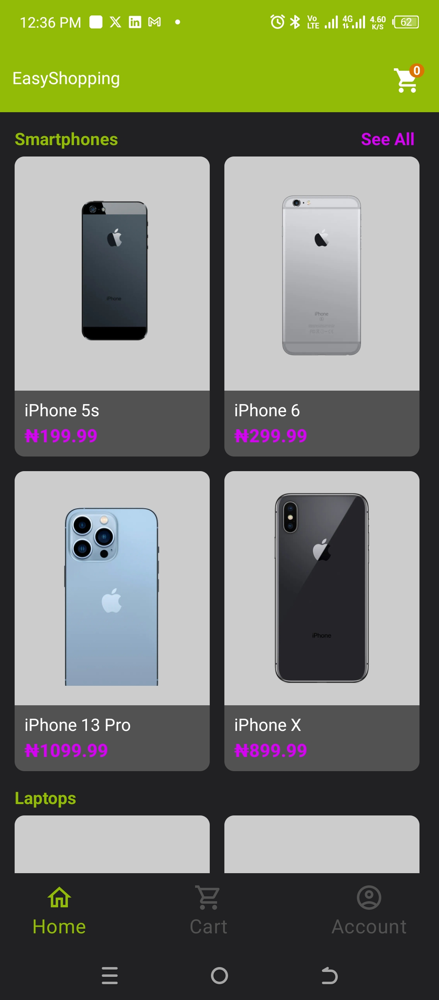
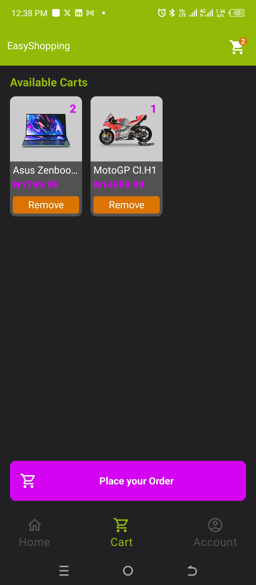
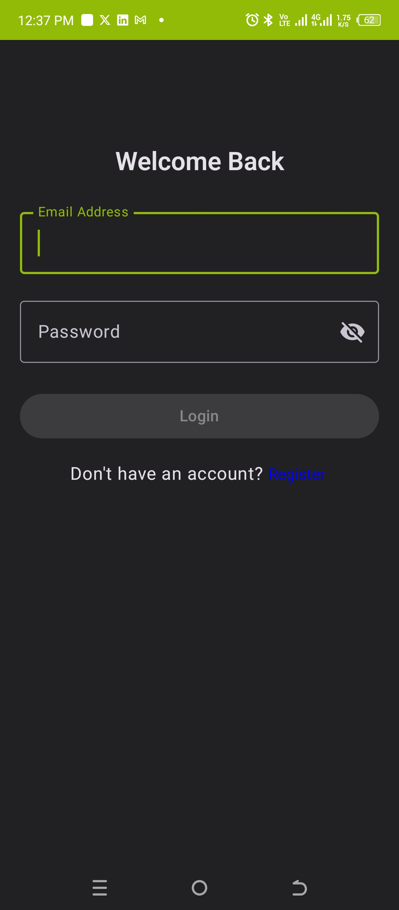
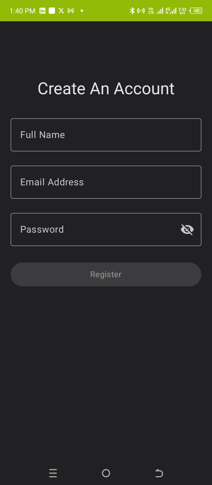
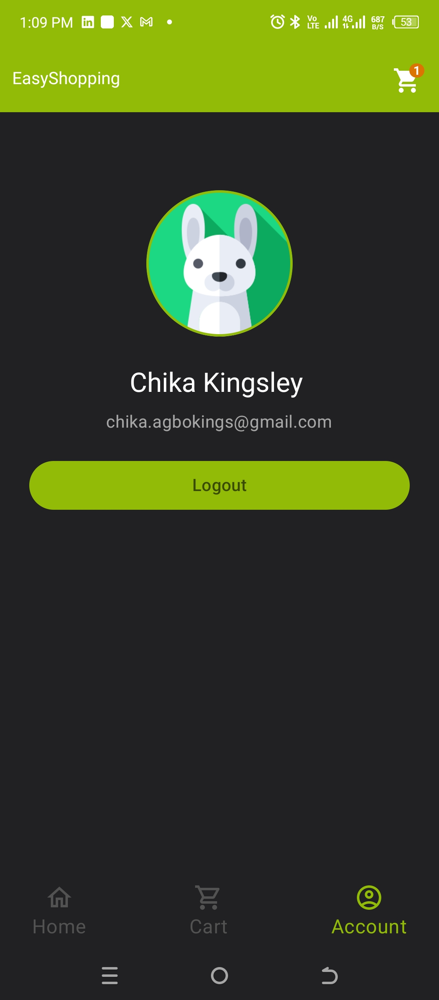

# 🛍️ EasyShopping: Simple E-Commerce Android App

This is a native Android e-commerce app built with **Jetpack Compose** and **Android Studio**. The app displays products from the [DummyJSON API](https://dummyjson.com/products), groups them by category, and allows users to add items to their cart and place orders.

## ✨ Features

- 📦 Load and display products from the DummyJSON API
- 🧩 Products grouped by category
- 🔐 User authentication via **AWS Amplify**
- 🛒 Add products to cart and place orders
- 💾 Cart and orders are stored locally using **Room Database**
- 📱 Built with Jetpack Compose for modern UI
- ⚙️ **Hilt** for dependency injection and state management

## 🧪 Tech Stack

- **Language:** Kotlin
- **UI:** Jetpack Compose
- **Authentication:** AWS Amplify
- **Local Storage:** Room Database
- **Dependency Injection:** Hilt
- **IDE:** Android Studio

## 🔐 Authentication

Authentication is handled using AWS Amplify. Users must register and log in to use the app’s shopping features like adding to cart or placing an order.

## 🖼️ Screenshots

| Home (Product Listing) | Product Detail | Cart |
|-----------|--------------|------|
|  |  |  |

| Login | Register | Account |
|-------|----------|---------|
|  |  |  |

